01\_traits\_EDA.R
================
peterinnes
2021-01-19

Exploratory Data analysis of LILE traits author: Peter Innes date: 1.13

``` r
library(dplyr)
library(ggplot2)
library(lme4)
library(arm)
library(magrittr)
library(tidyr)
```

Read-in collection data

``` r
env_data <- read.csv("data/LILE_seed_collection_spreadsheet.csv", header=T) %>% 
  mutate(source=as.factor(source), population=as.factor(population), Lat_s=scale(Lat), Long_s=scale(Long), Elev_m_s=scale(Elev_m)) #scale predictors
```

Read-in fruit-fill data.

``` r
ff_data <- read.csv("data/cleaned_LILE_yield_data_2013_fruit_fill.csv", header=T) %>%
  mutate(source=as.factor(source), block=as.factor(block)) %>%
  filter(trt=="B") %>% #exclude 'trt A' (non-study/non-harvested plants)
  left_join(dplyr::select(env_data,source,population,Lat,Lat_s,Long,Long_s,Elev_m,Elev_m_s)) 
```

    ## Joining, by = "source"

``` r
Appar <- ff_data %>% #list of individual Appar plants to exclude. 6 plants from source 22 are listed as Appar. Brent says go ahead and exclude this entire source.
  filter(notes==c("Appar")) %>%
  filter(trt=="B") %>%
  dplyr::select(source,trt,block,row,plot,plant)
Appar
```

    ##   source trt block row plot plant
    ## 1     14   B     6  31    6     4
    ## 2     22   B     2   6    2     5
    ## 3     22   B     4  18    6     3
    ## 4     22   B     7  37    5     2
    ## 5     22   B     7  37    5     3
    ## 6     22   B     7  37    5     4
    ## 7     22   B     8  38    1     1

``` r
ff_data <- ff_data %>% 
  filter(!source %in% c(2,5,22,32,38)) #exclude mistaken Appar sources
```

Read-in seed weight data

``` r
sd_wt_data <- read.csv("data/cleaned_LILE_yield_data_2013_seed_wt.csv", header = T) %>%
  filter(is.na(notes)) %>% #filter out rows with fewer than 50 seeds (described in notes column in spreadsheet, obs with standard 50 seeds have 'NA' in notes column)
  mutate(source=as.factor(source), block=as.factor(block)) %>%
  left_join(dplyr::select(env_data, source, population, Lat, Lat_s, Long, Long_s, Elev_m, Elev_m_s))
```

    ## Joining, by = "source"

``` r
sd_wt_data <- sd_wt_data %>% 
  dplyr::select(!notes) %>% #don't need this column anymore
  filter(!source %in% c(2,5,22,32,38)) # exclude mistaken Appar sources
```

Read-in stem data

``` r
stem_data <- read.csv("data/cleaned_LILE_yield_data_2013_stem_and_fruit.csv", header=T) %>%
mutate(source=as.factor(source), block=as.factor(block)) %>%
  filter(trt=="B") %>%
  left_join(dplyr::select(env_data,source,population,Lat,Lat_s,Long,Long_s,Elev_m,Elev_m_s)) 
```

    ## Joining, by = "source"

``` r
stem_data <- stem_data %>% 
  filter(!source %in% c(2,5,22,32,38)) #exclude mistaken Appar sources
```

Next gather relevant traits together in order to estimate yield. The
method here is to multiply the trait values within each accession at the
lowest level possible, since we lack individual plant data for seed
weight (the seed weight values are pooled at the ‘plot’ level—population
within block). Also, we have to take averages, at the plant level, of
the fruit per stem and buds/flowers per stem traits, since we have those
counts for multiple stems (up to 20) per plant. Also of note is that in
quite a few cases there are multiple plants of same source selected per
block, due to sampling methods: top 8 most vigorous plants across all
blocks selected as the ‘trt B’ study plants.

``` r
a <- stem_data %>%
  dplyr::select(source,population,block,row,plot,plant,num_of_stems) %>% 
  unique() #%>% 
#group_by(source,block) %>%
#summarise(num_stems=mean(num_of_stems))
b <- stem_data %>%
  group_by(source,population,block,row,plot,plant) %>%
  summarise(fruit_per_stem=mean(na.omit(fruits)), #mean number fruits, number buds and flowers, number forks, capsule diam, and stem diam, for individual plants.
            bds_flws_per_stem=mean(na.omit(bds_flow)),
            forks=mean(na.omit(forks)),
            caps_diam=mean(na.omit(diam_caps)),
            stem_diam=mean(na.omit(diam_stem))) 
```

    ## `summarise()` regrouping output by 'source', 'population', 'block', 'row', 'plot' (override with `.groups` argument)

``` r
c <- ff_data %>%
  group_by(source,population,block,row,plot,plant) %>%
  dplyr::select(source,population,block,row,plot,plant,good_fill) #%>%
#na.omit()
d <- sd_wt_data %>%
  group_by(source,population,block, row, plot) %>%
  summarise(sd_wt_50_ct=mean(sd_wt_50_ct)) #take average at the pooled population:block level
```

    ## `summarise()` regrouping output by 'source', 'population', 'block', 'row' (override with `.groups` argument)

``` r
yield_df <- full_join(a,b)
```

    ## Joining, by = c("source", "population", "block", "row", "plot", "plant")

``` r
yield_df <- full_join(yield_df,c)
```

    ## Joining, by = c("source", "population", "block", "row", "plot", "plant")

``` r
yield_df <- full_join(yield_df,d)
```

    ## Joining, by = c("source", "population", "block", "row", "plot")

``` r
head(yield_df)
```

    ##   source population block row plot plant num_of_stems fruit_per_stem
    ## 1      1       ID_1     1   3    2     4           18       41.72222
    ## 2      1       ID_1     2  10    5     1           26       41.75000
    ## 3      1       ID_1     5  25    8     5           28       64.75000
    ## 4      1       ID_1     7  36    1     2           36       38.65000
    ## 5      1       ID_1     8  41    2     3           23       48.60000
    ## 6      3       ID_3     1   3    5     4           55       37.40000
    ##   bds_flws_per_stem    forks caps_diam stem_diam good_fill sd_wt_50_ct
    ## 1          28.16667 9.444444     4.867     2.405      9.50    0.056350
    ## 2          34.15000 9.050000     4.923     2.797      7.60    0.090575
    ## 3          13.15000 8.900000     4.864     2.126      9.55    0.070000
    ## 4          15.75000 4.700000     5.000     2.147      8.60    0.075575
    ## 5          19.30000 6.850000     4.510     1.938      9.00    0.071175
    ## 6          12.65000 5.800000     4.790     2.295      8.85    0.117700

Next, impute missing seed weight values so that we can estimate yield
for plants that have trait data for everything except seed weight: use
the mean seed weight from all other plots of its population.

``` r
for ( i in 1:281 ){
  pop <- yield_df$population[i]
  pop_mn <- yield_df %>% filter(population==pop) %>% 
    dplyr::select(source,row,plot,sd_wt_50_ct) %>%
    unique() %>%
    summarise(mean(na.omit(sd_wt_50_ct)))
  pop_mn %<>% as.numeric()
  if( is.na(yield_df$sd_wt_50_ct[i]) ){
    print(yield_df[i,])
    yield_df$sd_wt_50_ct[i] <- pop_mn
  }
}
```

    ##    source population block row plot plant num_of_stems fruit_per_stem
    ## 29      7       ID_7     6  31    2     4           34           55.8
    ##    bds_flws_per_stem forks caps_diam stem_diam good_fill sd_wt_50_ct
    ## 29              21.1  8.45     4.669     2.556      9.15          NA
    ##     source population block row plot plant num_of_stems fruit_per_stem
    ## 119     19       UT_7     1   4    7     3           31          43.55
    ##     bds_flws_per_stem forks caps_diam stem_diam good_fill sd_wt_50_ct
    ## 119              8.55  7.95     5.104     2.625      9.05          NA
    ##     source population block row plot plant num_of_stems fruit_per_stem
    ## 120     19       UT_7     1   4    7     4           43          24.45
    ##     bds_flws_per_stem forks caps_diam stem_diam good_fill sd_wt_50_ct
    ## 120               9.1  3.95     4.994     1.972       9.3          NA
    ##     source population block row plot plant num_of_stems fruit_per_stem
    ## 173     26      NV_6a     7  33    3     3          120           33.2
    ##     bds_flws_per_stem forks caps_diam stem_diam good_fill sd_wt_50_ct
    ## 173               4.9   4.4     5.814     2.536         8          NA
    ##     source population block row plot plant num_of_stems fruit_per_stem
    ## 174     26      NV_6a     7  33    3     5           98           46.7
    ##     bds_flws_per_stem forks caps_diam stem_diam good_fill sd_wt_50_ct
    ## 174              7.05   5.7     6.216     2.476       8.8          NA
    ##     source population block row plot plant num_of_stems fruit_per_stem
    ## 214     31      NV_10     7  32    2     2          107           42.6
    ##     bds_flws_per_stem forks caps_diam stem_diam good_fill sd_wt_50_ct
    ## 214              6.95   6.5     6.048     3.085      8.95          NA
    ##     source population block row plot plant num_of_stems fruit_per_stem
    ## 223     34      NV_12     1   4    4     3           28             35
    ##     bds_flws_per_stem forks caps_diam stem_diam good_fill sd_wt_50_ct
    ## 223              16.9  6.75     5.101     2.258       9.5          NA

Add new column with the estimated yield (EST\_YIELD)

``` r
yield_df <- yield_df %>%
  na.omit() %>%
  mutate(EST_YIELD = num_of_stems 
         * (fruit_per_stem + bds_flws_per_stem) 
         * good_fill 
         * (sd_wt_50_ct/50)) %>%
  group_by(population,block) %>%
  arrange(as.character(population))
write.csv(yield_df,file="data/yield_data.csv", row.names = FALSE)
```

#### EXPLORATORY DATA ANALYSIS

Histograms of each stem-related trait.

``` r
stem_data %>%
  dplyr::select(fruits,bds_flow,forks,diam_caps,diam_stem, num_of_stems) %>%
  gather(key="trait", value="trait_value") %>%
  ggplot() +
  geom_histogram(mapping=aes(x=trait_value,y=stat(density)), bins=75) +
  facet_wrap(facets = ~ trait, scales="free")
```

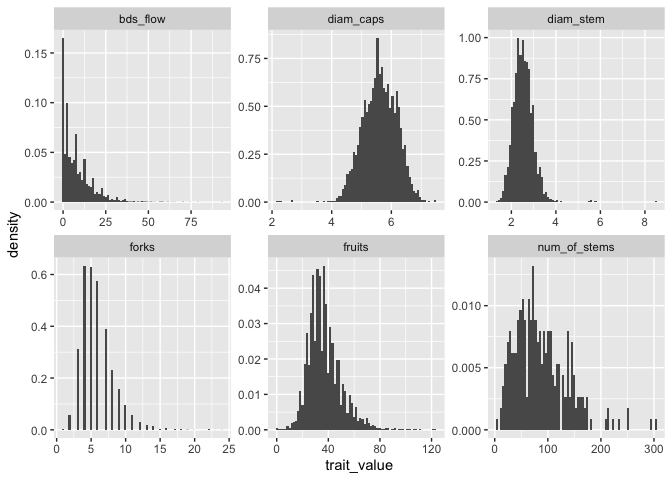<!-- -->

Histograms from fruit fill data. All histos look the same (except bad
seeds) bc they are essentially different measures of the same trait.
We’ll only look at good\_fill for subsequent analyses.

``` r
ff_data %>%
  dplyr::select(good_sds,bad_sds,tot_sds,good_fill,tot_fill) %>%
  gather(key="trait", value="trait_value") %>%
  ggplot() +
  geom_histogram(mapping=aes(x=trait_value,y=stat(density)), bins=30) +
  facet_wrap(facets = ~ trait, scales="free")
```

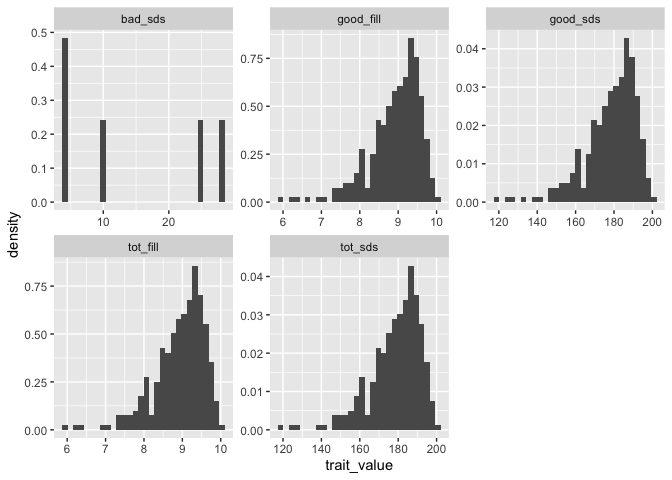<!-- -->

Histogram of seed weight

``` r
sd_wt_data %>%
  ggplot() +
  geom_histogram(mapping=aes(x=sd_wt_50_ct,y=stat(density)),bins=30)
```

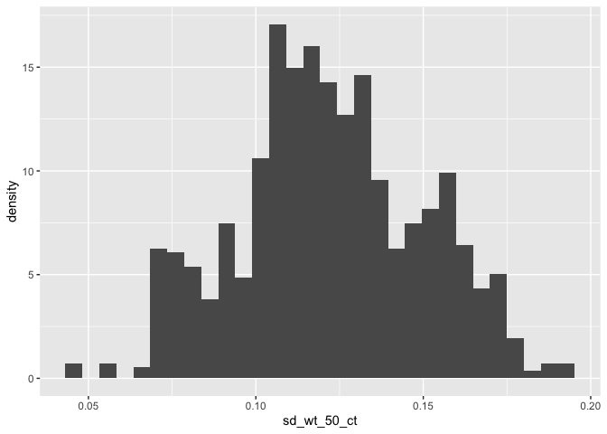<!-- -->

Now we’ll go through each trait, starting with seed weight.

``` r
# Violin plots of seed weight by population, and by block, separately
ggplot(data=sd_wt_data, aes(x=reorder(population, sd_wt_50_ct), y=sd_wt_50_ct)) +
  geom_violin(alpha=0.5) + 
  theme(axis.text.x = element_text(angle=45, size=6))
```

    ## Warning: Removed 10 rows containing non-finite values (stat_ydensity).

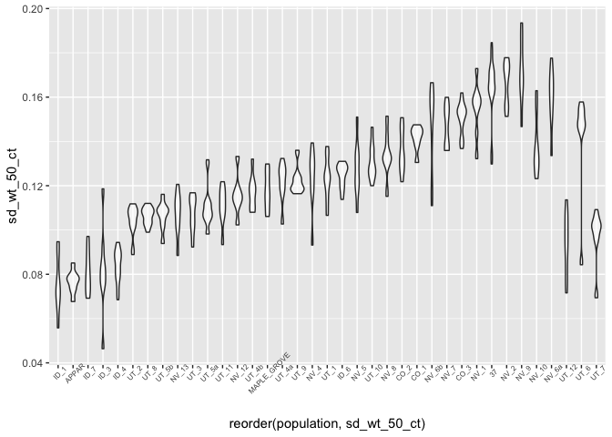<!-- -->

``` r
ggplot(data=sd_wt_data, aes(x=reorder(block, sd_wt_50_ct), y=sd_wt_50_ct)) +
  geom_violin(alpha=0.5) + 
  theme(axis.text.x = element_text(angle=45, size=6)) #does not appear to be any block effect. good. 
```

    ## Warning: Removed 10 rows containing non-finite values (stat_ydensity).

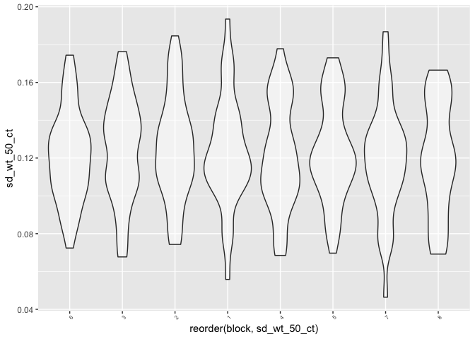<!-- -->

Plot Seed weight by population and block, simultaneously. A couple
things jump out from this plot: NV 3 has way more variation than most of
the other populations, UT\_7 seems to have a couple outliers, but looks
like it is just due to a single block

``` r
sd_wt_data %>%
  mutate(yjit=jitter(0*sd_wt_50_ct)) %>%
  ggplot() +
  geom_point(mapping=aes(x=sd_wt_50_ct, col=block, y=yjit),shape=1,alpha=0.5) +
  facet_wrap(facets = ~ population) +
  ylim(-0.1,0.1)
```

    ## Warning: Removed 10 rows containing missing values (geom_point).

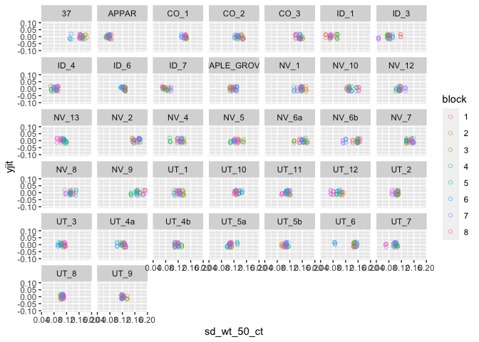<!-- -->

Double check sample sizes to verify balanced design. Most all pops have
n=32, a few populations have n=28. Pop 38 has n=12—this may be of
concern. But, looking at the previous plots, pop 38 does not appear to
have elevated uncertainty. We actually end up excluding pop38 because it
was Appar.

``` r
sd_wt_data %>%
  group_by(population) %>%
  summarise(sample_size=n()) %>%
  arrange(-sample_size) %>%
  print(n=Inf)
```

    ## `summarise()` ungrouping output (override with `.groups` argument)

    ## # A tibble: 37 x 2
    ##    population  sample_size
    ##    <fct>             <int>
    ##  1 37                   32
    ##  2 APPAR                32
    ##  3 CO_2                 32
    ##  4 CO_3                 32
    ##  5 ID_3                 32
    ##  6 ID_4                 32
    ##  7 MAPLE_GROVE          32
    ##  8 NV_1                 32
    ##  9 NV_10                32
    ## 10 NV_13                32
    ## 11 NV_2                 32
    ## 12 NV_5                 32
    ## 13 NV_6b                32
    ## 14 NV_7                 32
    ## 15 UT_1                 32
    ## 16 UT_10                32
    ## 17 UT_11                32
    ## 18 UT_3                 32
    ## 19 UT_4b                32
    ## 20 UT_5a                32
    ## 21 UT_5b                32
    ## 22 UT_8                 32
    ## 23 NV_4                 31
    ## 24 NV_6a                31
    ## 25 UT_12                31
    ## 26 UT_4a                31
    ## 27 UT_6                 31
    ## 28 UT_7                 31
    ## 29 UT_9                 31
    ## 30 CO_1                 28
    ## 31 ID_7                 28
    ## 32 NV_8                 28
    ## 33 NV_9                 28
    ## 34 UT_2                 28
    ## 35 ID_1                 27
    ## 36 ID_6                 27
    ## 37 NV_12                27

I suspect a normal distribution will be appropriate for modeling seed
weight, as it is a continuous trait. Let’s check the normal fit for just
a few populations.

``` r
# Summary stats for 5 counties
```

``` r
set.seed(4)
sw5pops <- sd_wt_data %>% 
  dplyr::select(population,block,sd_wt_50_ct) %>%
  na.omit() %>%
  group_by(population) %>%
  summarise(mean=mean(sd_wt_50_ct), sd=sd(sd_wt_50_ct), n=n(), min=min(sd_wt_50_ct), max=max(sd_wt_50_ct)) %>%
  sample_n(5)
sw5pops
```

Normal fitted for the 5 pops

``` r
norm_df <- NULL
for ( i in 1:5 ) {
  x <- seq(sw5pops$min[i],sw5pops$max[i],length.out = 100)
  y <- dnorm(x, sw5pops$mean[i], sw5pops$sd[i])
  norm_df <- rbind(norm_df,data.frame(x,y,population=sw5pops$population[i]))
}
rm(x,y) #clean up
head(norm_df)
```

    ##           x        y  population
    ## 1 0.1061000 17.34642 MAPLE_GROVE
    ## 2 0.1063394 18.08923 MAPLE_GROVE
    ## 3 0.1065788 18.84756 MAPLE_GROVE
    ## 4 0.1068182 19.62071 MAPLE_GROVE
    ## 5 0.1070576 20.40793 MAPLE_GROVE
    ## 6 0.1072970 21.20840 MAPLE_GROVE

Plot observed data with expected distribution overlaid, by population.
The normal appears to fit some populations better than others, but
overall looks good

``` r
sd_wt_data %>%
  group_by(population) %>%
  filter(population%in%sw5pops$population) %>%
  ggplot() +
  geom_histogram(mapping=aes(x=sd_wt_50_ct, y=stat(density)), bins=30) +
  geom_density(mapping=aes(x=sd_wt_50_ct), col="blue") +
  geom_line(data=norm_df, mapping=aes(x=x,y=y), col="red") +
  facet_wrap(facets = ~ population)
```

<!-- -->

Now for the whole data set, by block

``` r
sw_byblock <- sd_wt_data %>% 
  dplyr::select(population,block,sd_wt_50_ct) %>%
  na.omit() %>%
  group_by(block) %>%
  summarise(mean=mean(sd_wt_50_ct), sd=sd(sd_wt_50_ct), n=n(), min=min(sd_wt_50_ct), max=max(sd_wt_50_ct))
```

Normal fitted for 8 blocks

``` r
norm_df <- NULL
for (i in 1:length(sw_byblock$block)) {
  x <- seq(sw_byblock$min[i],sw_byblock$max[i],length.out = 100)
  y <- dnorm(x, sw_byblock$mean[i], sw_byblock$sd[i])
  norm_df <- rbind(norm_df, data.frame(x,y, block=sw_byblock$block[i]))
}
rm(x,y)
head(norm_df)
```

    ##            x         y block
    ## 1 0.05580000 0.8913251     1
    ## 2 0.05719091 0.9965413     1
    ## 3 0.05858182 1.1115969     1
    ## 4 0.05997273 1.2370644     1
    ## 5 0.06136364 1.3735047     1
    ## 6 0.06275455 1.5214612     1

Plot observed data and fitted normal. Looks good.

``` r
sd_wt_data %>%
  ggplot() +
  geom_histogram(mapping=aes(x=sd_wt_50_ct, y=stat(density)), bins=30) +
  geom_density(mapping=aes(x=sd_wt_50_ct), col="blue") +
  geom_line(data=norm_df, mapping=aes(x=x,y=y), col="red") +
  facet_wrap(facets = ~ block)
```

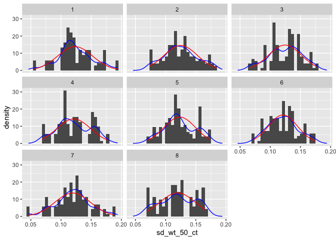<!-- -->

EDA of fruit fill. Same steps as above

``` r
set.seed(7)
ff5pops <- ff_data %>% 
  dplyr::select(population,block,good_fill) %>%
  na.omit() %>%
  group_by(population) %>%
  summarise(mean=mean(good_fill), sd=sd(good_fill), n=n(), min=min(good_fill), max=max(good_fill)) %>%
  sample_n(5)
ff5pops
```

Normal fitted for the 5 pops

``` r
norm_df <- NULL
for ( i in 1:5 ) {
  x <- seq(ff5pops$min[i],ff5pops$max[i],length.out = 100)
  y <- dnorm(x, ff5pops$mean[i], ff5pops$sd[i])
  norm_df <- rbind(norm_df,data.frame(x,y,population=ff5pops$population[i]))
}
rm(x,y) #clean up
head(norm_df)
```

    ##          x          y population
    ## 1 6.900000 0.05235223      NV_6a
    ## 2 6.930808 0.05568734      NV_6a
    ## 3 6.961616 0.05917850      NV_6a
    ## 4 6.992424 0.06282865      NV_6a
    ## 5 7.023232 0.06664043      NV_6a
    ## 6 7.054040 0.07061615      NV_6a

Plot observed vs fitted. normal distro appears to fit sufficiently well.

``` r
ff_data %>% group_by(population) %>%
  filter(population%in%ff5pops$population) %>%
  ggplot() +
  geom_histogram(mapping=aes(x=good_fill, y=stat(density)), bins=30) +
  geom_density(mapping=aes(x=good_fill), col="blue") +
  geom_line(data=norm_df, mapping=aes(x=x,y=y), col="red") +
  facet_wrap(facets = ~ population)
```

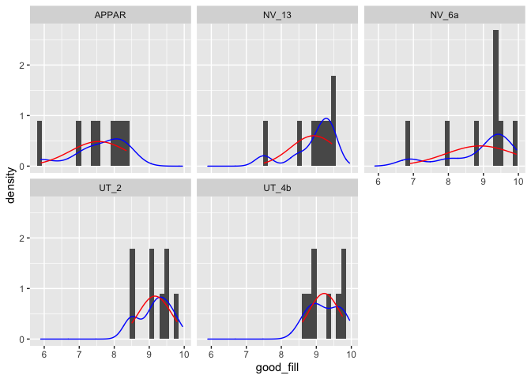<!-- -->

EDA of number of stems per plant

``` r
stems <- stem_data %>% dplyr::select(population,block,row,plot,plant,num_of_stems) %>%
  unique() #unique values only because original spreadsheet had both plant-level and stem-level data. We just want number of stems per plant, which is plant-level.
```

Summary statistics, by population. Variance appears much larger than the
mean, so it’s over-dispersed. Poisson might not be appropriate. negative
binomial instead?

``` r
ns_summary <- stems %>%
  na.omit() %>%
  group_by(population) %>%
  summarise(mean=mean(num_of_stems),sd=sd(num_of_stems),var=sd(num_of_stems)^2,n=n()) 
```

    ## `summarise()` ungrouping output (override with `.groups` argument)

``` r
head(ns_summary) 
```

    ## # A tibble: 6 x 5
    ##   population  mean    sd    var     n
    ##   <fct>      <dbl> <dbl>  <dbl> <int>
    ## 1 37          99   32.6  1065.      8
    ## 2 APPAR      197.  59.5  3540.      8
    ## 3 CO_1       110.  32.5  1059.      8
    ## 4 CO_2        86.8 34.4  1187.      8
    ## 5 CO_3       149.  39.8  1587.      8
    ## 6 ID_1        26.2  6.65   44.2     5

``` r
table(ns_summary$n) #Mostly balanced design, with n=8 for 34 populations, n=7 for 1 pop, n=5 for 2 pops, n=4 for 2 pops.
```

    ## 
    ##  4  5  7  8 
    ##  2  2  1 32

Histograms by population. Small sample size at the population level
could make this difficult to model—the distributions at this level are
mostly uniform.

``` r
stems %>%
  ggplot() +
  geom_histogram(mapping=aes(x=num_of_stems,y=stat(density))) +
  facet_wrap(facets = ~ population, scales="free")
```

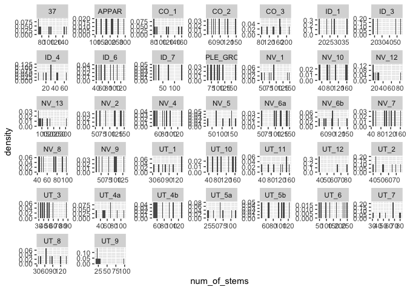<!-- -->

Violin plots of number of stems by population, and by block, separately.
Populations with the largest num\_of\_stems value also appear to have
the largest variance. Blocks 1,2,3 appear to have more outliers in large
stem number values compared to the other blocks. For stem data, there is
just one plant per block.

``` r
ggplot(data=stems, aes(x=reorder(population, num_of_stems), y=num_of_stems)) +
  geom_violin(alpha=0.5) + 
  theme(axis.text.x = element_text(angle=45, size=6))
```

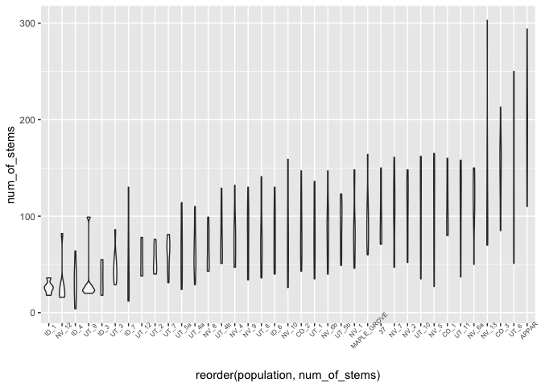<!-- -->

``` r
ggplot(data=stems, aes(x=block, y=num_of_stems)) +
  geom_violin(alpha=0.5) + 
  theme(axis.text.x = element_text(angle=45, size=6)) 
```

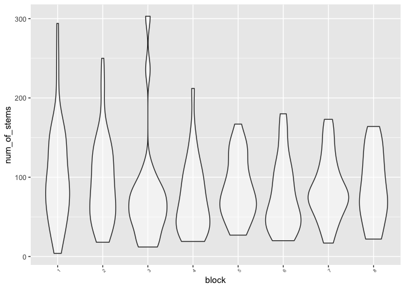<!-- -->

Number of stems by population and block, simultaneously. Population is
faceted, block is color-coded. This plot reveals some peculilarities in
the data: not every population is represented in every block. Some
populations have multiple plants from same block. But, it is still close
to a balanced design.

``` r
stems %>%
  mutate(yjit=jitter(0*num_of_stems)) %>%
  ggplot() +
  geom_point(mapping=aes(x=num_of_stems, col=block, y=yjit),shape=1,alpha=0.5) +
  facet_wrap(facets = ~ population) +
  ylim(-0.1,0.1)
```

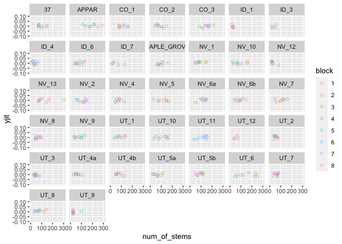<!-- -->

What distribution to use in modeling number of stems? It appears to be a
highly variable trait—variance is much larger than the mean, nearly
across the board. Overdispersed poisson could work, though normal may
still suffice.  EDA for estimated yield

``` r
yield_summ <- yield_df %>%
  group_by(source,population) %>%
  na.omit() %>%
  summarise(mean=mean(EST_YIELD), se=sd(EST_YIELD)/sqrt(n()), n=n())
```

    ## `summarise()` regrouping output by 'source' (override with `.groups` argument)

``` r
yield_df %>%
  ggplot() +
  geom_histogram(mapping=aes(x=EST_YIELD,y=stat(density)),bins=30)
```

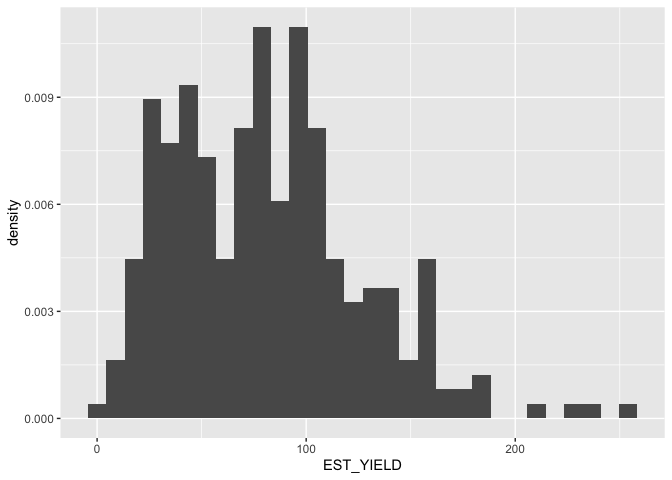<!-- -->

``` r
ggplot(data=yield_df, aes(x=reorder(population, EST_YIELD), y=EST_YIELD)) +
  geom_violin(alpha=0.5) + 
  theme(axis.text.x = element_text(angle=45, size=6))
```

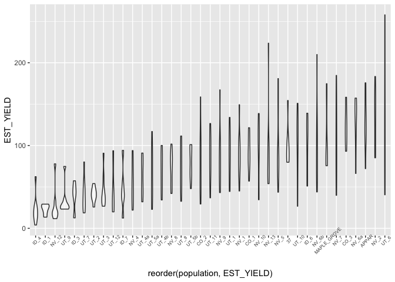<!-- -->

``` r
ggplot(data=yield_df, aes(x=reorder(block, EST_YIELD), y=EST_YIELD)) +
  geom_violin(alpha=0.5) + 
  theme(axis.text.x = element_text(angle=45, size=6)) #does not appear to be any block effect. 
```

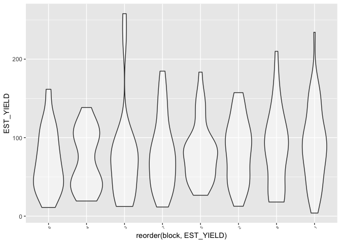<!-- -->

``` r
yield_df %>% 
  na.omit() %>%
  mutate(yjit=jitter(0*EST_YIELD)) %>%
  ggplot() +
  geom_point(mapping=aes(x=EST_YIELD, col=block, y=yjit),shape=1,alpha=0.5) +
  facet_wrap(facets = ~ population) +
  ylim(-0.1,0.1)
```

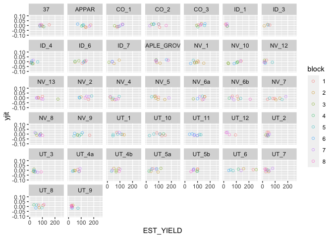<!-- -->

``` r
yield_df %>% na.omit() %>%
  group_by(population) %>%
  summarise(sample_size=n()) %>%
  arrange(-sample_size) %>%
  print(n=Inf)
```

    ## `summarise()` ungrouping output (override with `.groups` argument)

    ## # A tibble: 37 x 2
    ##    population  sample_size
    ##    <fct>             <int>
    ##  1 37                    8
    ##  2 APPAR                 8
    ##  3 CO_1                  8
    ##  4 CO_2                  8
    ##  5 CO_3                  8
    ##  6 ID_4                  8
    ##  7 ID_6                  8
    ##  8 MAPLE_GROVE           8
    ##  9 NV_1                  8
    ## 10 NV_10                 8
    ## 11 NV_13                 8
    ## 12 NV_2                  8
    ## 13 NV_4                  8
    ## 14 NV_5                  8
    ## 15 NV_6a                 8
    ## 16 NV_6b                 8
    ## 17 NV_7                  8
    ## 18 NV_8                  8
    ## 19 NV_9                  8
    ## 20 UT_1                  8
    ## 21 UT_10                 8
    ## 22 UT_11                 8
    ## 23 UT_2                  8
    ## 24 UT_3                  8
    ## 25 UT_4a                 8
    ## 26 UT_4b                 8
    ## 27 UT_5a                 8
    ## 28 UT_5b                 8
    ## 29 UT_6                  8
    ## 30 UT_7                  8
    ## 31 UT_8                  8
    ## 32 UT_9                  8
    ## 33 NV_12                 7
    ## 34 ID_1                  5
    ## 35 ID_7                  5
    ## 36 ID_3                  4
    ## 37 UT_12                 4

Check fit of different distros: normal, log-normal, gamma

``` r
set.seed(39)
yield_df <- mutate(yield_df, log_EST_YIELD=log(ifelse(EST_YIELD==0,0.1,EST_YIELD)))
# randomly select 5 pops (ended up changing to 25 pops though)
yield5pops <- yield_df %>% 
  dplyr::select(population,block,EST_YIELD,log_EST_YIELD) %>%
  na.omit() %>%
  group_by(population) %>%
  summarise(mean=mean(EST_YIELD), sd=sd(EST_YIELD), min=min(EST_YIELD), max=max(EST_YIELD), n=n(), logmean=mean(log_EST_YIELD), logsd=sd(log_EST_YIELD), logmin=min(log_EST_YIELD), logmax=max(log_EST_YIELD)) %>%
  sample_n(25)
```

    ## `summarise()` ungrouping output (override with `.groups` argument)

``` r
yield5pops
```

    ## # A tibble: 25 x 10
    ##    population  mean    sd   min   max     n logmean logsd logmin logmax
    ##    <fct>      <dbl> <dbl> <dbl> <dbl> <int>   <dbl> <dbl>  <dbl>  <dbl>
    ##  1 NV_6a      127.   31.6 66.2  157.      8    4.81 0.295   4.19   5.06
    ##  2 ID_4        22.7  17.7  3.94  62.3     8    2.87 0.798   1.37   4.13
    ##  3 NV_12       27.9  22.9 11.6   77.8     7    3.13 0.624   2.45   4.35
    ##  4 UT_1        87.9  32.5 44.5  134.      8    4.41 0.413   3.80   4.90
    ##  5 NV_1        89.8  31.2 45.0  149.      8    4.44 0.357   3.81   5.01
    ##  6 NV_10       93.5  39.4 34.4  139.      8    4.43 0.545   3.54   4.93
    ##  7 NV_5        97.8  45.3 43.6  181.      8    4.49 0.451   3.77   5.20
    ##  8 UT_4a       62.7  23.3 32.0   90.9     8    4.07 0.401   3.46   4.51
    ##  9 ID_7        47.3  29.9 12.4   94.1     5    3.67 0.739   2.51   4.54
    ## 10 UT_5a       66.2  32.2 22.8  117.      8    4.07 0.548   3.13   4.76
    ## # … with 15 more rows

Normal fitted for the random pops

``` r
norm_df <- NULL
for ( i in 1:25 ) {
  x <- seq(yield5pops$min[i],yield5pops$max[i],length.out = 100)
  y <- dnorm(x, yield5pops$mean[i], yield5pops$sd[i])
  norm_df <- rbind(norm_df,data.frame(x,y,population=yield5pops$population[i]))
}
rm(x,y) #clean up
head(norm_df)
```

    ##          x           y population
    ## 1 66.16843 0.001931751      NV_6a
    ## 2 67.08871 0.002042933      NV_6a
    ## 3 68.00899 0.002158684      NV_6a
    ## 4 68.92926 0.002279063      NV_6a
    ## 5 69.84954 0.002404118      NV_6a
    ## 6 70.76982 0.002533888      NV_6a

Gamma fitted for the random pops

``` r
gamma_df <- NULL
for ( i in 1:25 ) {
  x <- seq(yield5pops$min[i],yield5pops$max[i],length.out = 100)
  y <- dgamma(x, (yield5pops$mean[i]/yield5pops$sd[i])^2, yield5pops$mean[i]/yield5pops$sd[i]^2)
  gamma_df <- rbind(gamma_df,data.frame(x,y,population=yield5pops$population[i]))
}
rm(x,y) #clean up
head(gamma_df)
```

    ##          x           y population
    ## 1 66.16843 0.001418523      NV_6a
    ## 2 67.08871 0.001557109      NV_6a
    ## 3 68.00899 0.001704338      NV_6a
    ## 4 68.92926 0.001860290      NV_6a
    ## 5 69.84954 0.002025002      NV_6a
    ## 6 70.76982 0.002198475      NV_6a

Lognormal fitted. This distro appears to fit best.

``` r
lognorm_df <- NULL
for ( i in 1:25 ) {
  x <- seq(yield5pops$logmin[i],yield5pops$logmax[i],length.out = 100)
  y <- dnorm(x, yield5pops$logmean[i], yield5pops$logsd[i])
  lognorm_df <- rbind(lognorm_df,data.frame(x,y,population=yield5pops$population[i]))
}
rm(x,y) #clean up
head(lognorm_df)
```

    ##          x         y population
    ## 1 4.192204 0.1475350      NV_6a
    ## 2 4.200949 0.1569536      NV_6a
    ## 3 4.209694 0.1668272      NV_6a
    ## 4 4.218440 0.1771665      NV_6a
    ## 5 4.227185 0.1879817      NV_6a
    ## 6 4.235931 0.1992822      NV_6a

Plot fitted normal distro

``` r
yield_df %>%
  group_by(population) %>%
  filter(population%in%yield5pops$population) %>%
  ggplot() +
  geom_histogram(mapping=aes(x=EST_YIELD, y=stat(density)), bins=30) +
  geom_density(mapping=aes(x=EST_YIELD), col="blue") +
  geom_line(data=norm_df, mapping=aes(x=x,y=y), col="red") +
  facet_wrap(facets = ~ population)
```

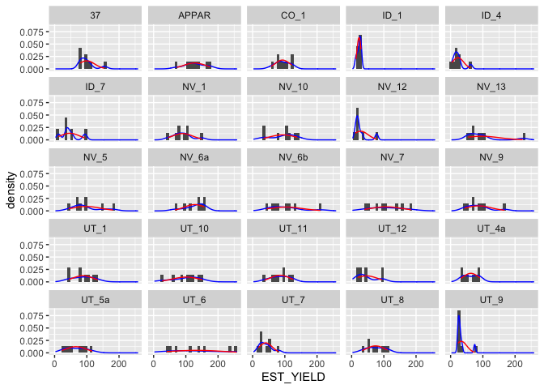<!-- -->

Plot fitted log-normal distro

``` r
yield_df %>%
  group_by(population) %>%
  filter(population%in%yield5pops$population) %>%
  ggplot() +
  geom_histogram(mapping=aes(x=log_EST_YIELD, y=stat(density)), bins=30) +
  geom_density(mapping=aes(x=log_EST_YIELD), col="blue") +
  geom_line(data=lognorm_df, mapping=aes(x=x,y=y), col="red") +
  facet_wrap(facets = ~ population)
```

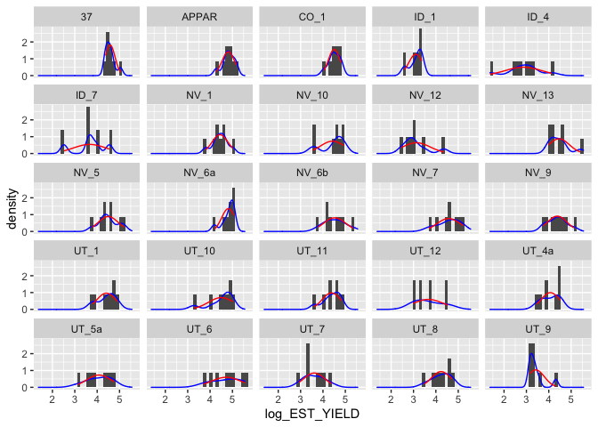<!-- -->

Plot fitted gamma distro

``` r
yield_df %>%
  group_by(population) %>%
  filter(population%in%yield5pops$population) %>%
  ggplot() +
  geom_histogram(mapping=aes(x=EST_YIELD, y=stat(density)), bins=30) +
  geom_density(mapping=aes(x=EST_YIELD), col="blue") +
  geom_line(data=gamma_df, mapping=aes(x=x,y=y), col="red") +
  facet_wrap(facets = ~ population)
```

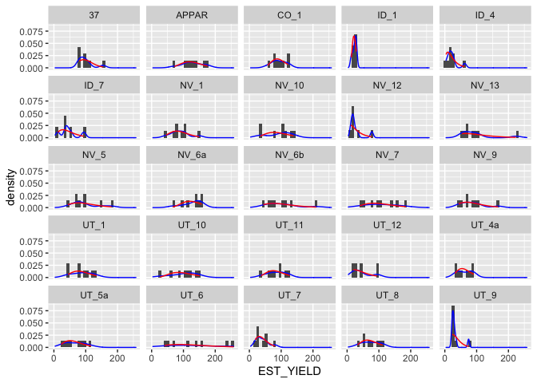<!-- -->

EDA miscellaneous scraps

``` r
# More histograms
stem_data %>%
  dplyr::select(fruits,bds_flow,forks,diam_caps,diam_stem, num_of_stems) %>%
  gather(key="trait", value="trait_value") %>%
  ggplot() +
  geom_histogram(mapping=aes(x=trait_value,y=stat(density)), bins=75) +
  facet_wrap(facets = ~ trait, scales="free")
```

    ## Warning: Removed 5725 rows containing non-finite values (stat_bin).

<!-- -->

``` r
sd_wt_data %>%
  ggplot() +
  geom_histogram(mapping=aes(x=sd_wt_50_ct,y=stat(density)),bins=30)
```

    ## Warning: Removed 10 rows containing non-finite values (stat_bin).

<!-- -->

``` r
ff_data %>%
  dplyr::select(good_sds,bad_sds,tot_sds,good_fill,tot_fill) %>%
  gather(key="trait", value="trait_value") %>%
  ggplot() +
  geom_histogram(mapping=aes(x=trait_value,y=stat(density)), bins=30) +
  facet_wrap(facets = ~ trait, scales="free")
```

    ## Warning: Removed 351 rows containing non-finite values (stat_bin).

<!-- -->

``` r
# Data summaries
sw_summ <-
  sd_wt_data %>% 
  dplyr::select(population,block,sd_wt_50_ct) %>%
  na.omit() %>%
  group_by(population) %>%
  summarise(mean=mean(sd_wt_50_ct), sd=sd(sd_wt_50_ct), n=n(), min=min(sd_wt_50_ct), max=max(sd_wt_50_ct))
```

    ## `summarise()` ungrouping output (override with `.groups` argument)

``` r
sn_summ <- stem_data %>%
  dplyr::select(source,population,block,row,plot,plant,num_of_stems) %>%
  unique() %>%
  na.omit() %>%
  group_by(population, source) %>%
  summarise(mean=mean(num_of_stems),se=sd(num_of_stems)/sqrt(n()), cv=100*(sd(num_of_stems)/mean(num_of_stems)), n=n()) #Variance is much larger than the mean, so its overdispersed. poisson might not be appropriate. negative binomial instead?
```

    ## `summarise()` regrouping output by 'population' (override with `.groups` argument)

``` r
fruit_summ <- stem_data %>%
  dplyr::select(population,block,row,plant,stem_no,fruits) %>%
  na.omit() %>%
  group_by(population) %>%
  summarise(mean=mean(fruits), sd=sd(fruits), var=sd(fruits)^2, n=n()) #Also overdispersed. poisson might not be appropriate. negative binomial instead?
```

    ## `summarise()` ungrouping output (override with `.groups` argument)

``` r
# compare 'trt A (non-study)' with 'trt B (study)'
ff_data %>%
  group_by(trt) %>%
  summarise(mean=mean(na.omit(good_fill)), sd=sd(na.omit(good_fill)), n=n())
```

    ## `summarise()` ungrouping output (override with `.groups` argument)

    ## # A tibble: 1 x 4
    ##   trt    mean    sd     n
    ##   <chr> <dbl> <dbl> <int>
    ## 1 B      8.92 0.679   296

``` r
#ggplot(aes(x=trt, y=good_fill)) +
#geom_violin()

forks_summ <- stem_data %>%
  dplyr::select(population,block,row,plant,stem_no,forks) %>%
  na.omit() %>%
  group_by(population) %>%
  summarise(mean=mean(forks), sd=sd(forks), var=sd(forks)^2, n=n()) #Mostly underdispersed, but some overdispersion (at population level). Also, not all pops have fork numbers from full 160 stems (8 blocks x 1 plant x 20 stems)
```

    ## `summarise()` ungrouping output (override with `.groups` argument)

``` r
# Check for block effect in forks data
stem_data %>%
  group_by(block) %>%
  ggplot(aes(x=block, y=forks)) +
  geom_violin()
```

    ## Warning: Removed 35 rows containing non-finite values (stat_ydensity).

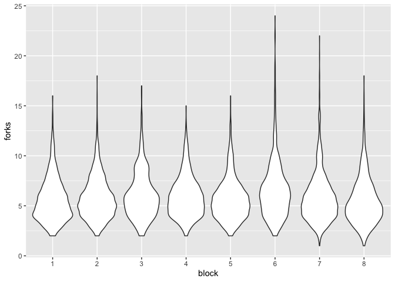<!-- -->

``` r
ff_summ <- ff_data %>%
  dplyr::select(population,block,good_fill) %>%
  na.omit() %>%
  group_by(population) %>%
  summarise(mean=mean(good_fill), sd=sd(good_fill), var=sd(good_fill)^2, n=n()) #Fruit fill is underdispersed—variance is less than the mean.
```

    ## `summarise()` ungrouping output (override with `.groups` argument)

``` r
#### Box plots of all the traits
# estimated yield
ggplot(data=yield_df, aes(x=reorder(population,EST_YIELD), y=EST_YIELD)) +
  geom_boxplot()
```

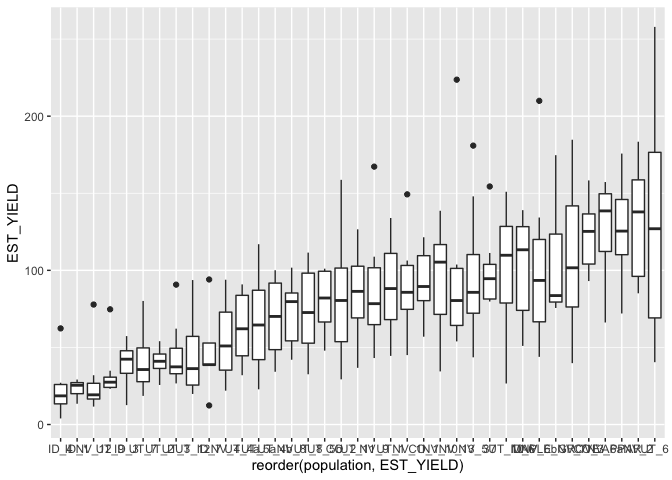<!-- -->

``` r
# seed weight
ggplot(data=sd_wt_data, aes(x=population, y=sd_wt_50_ct)) +
  geom_boxplot(alpha=0.5) + 
  theme(axis.text.x = element_text(angle=45, size=6))
```

    ## Warning: Removed 10 rows containing non-finite values (stat_boxplot).

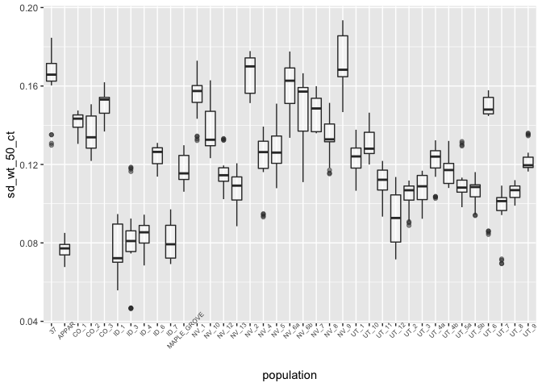<!-- -->

``` r
# fruit fill
ggplot(data=filter(ff_data, trt=="B"), aes(x=population, y=good_fill)) +
  geom_boxplot(alpha=0.5) + 
  theme(axis.text.x = element_text(angle=45, size=6))
```

    ## Warning: Removed 15 rows containing non-finite values (stat_boxplot).

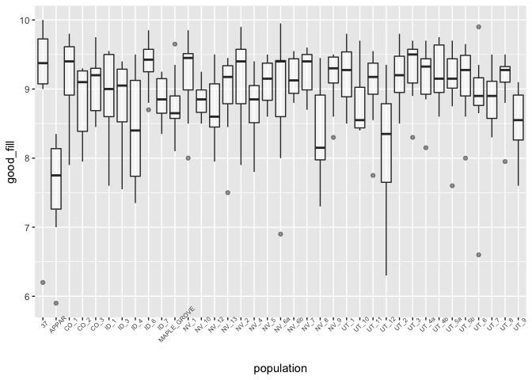<!-- -->

``` r
# fruit per stem
ggplot(data=filter(stem_data, trt=="B"), aes(x=population, y=fruits)) +
  geom_boxplot(alpha=0.5) + 
  theme(axis.text.x = element_text(angle=45, size=6)) 
```

    ## Warning: Removed 35 rows containing non-finite values (stat_boxplot).

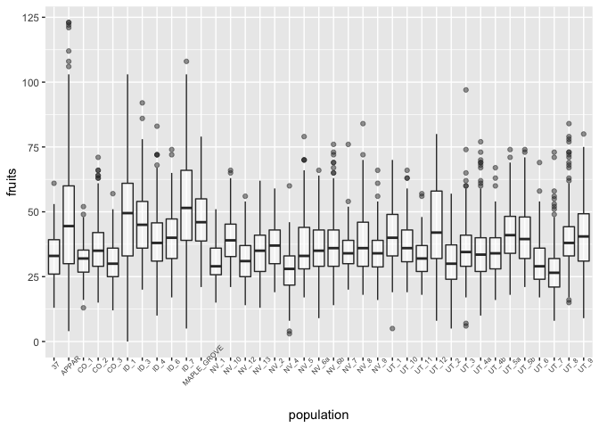<!-- -->

``` r
# number of stems
ggplot(data=filter(stem_data, trt=="B"), aes(x=population, y=num_of_stems)) +
  geom_boxplot(alpha=0.5) + 
  theme(axis.text.x = element_text(angle=45, size=6))
```

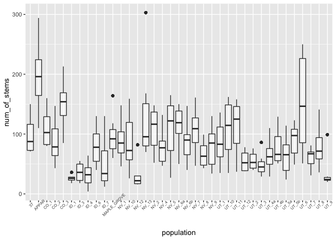<!-- -->

``` r
# forks per stem
ggplot(data=filter(stem_data, trt=="B"), aes(x=population, y=forks)) +
  geom_boxplot(alpha=0.5) + 
  theme(axis.text.x = element_text(angle=45, size=6)) 
```

    ## Warning: Removed 35 rows containing non-finite values (stat_boxplot).

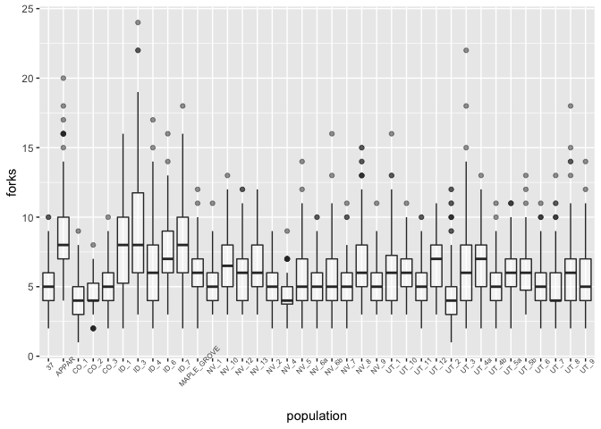<!-- -->

``` r
# stem diameter
ggplot(data=filter(stem_data, trt=="B"), aes(x=population, y=diam_stem)) + # big outlier in source 6. 8mm stem diameter?? 
  geom_boxplot(alpha=0.5) + 
  theme(axis.text.x = element_text(angle=45, size=6)) 
```

    ## Warning: Removed 2810 rows containing non-finite values (stat_boxplot).

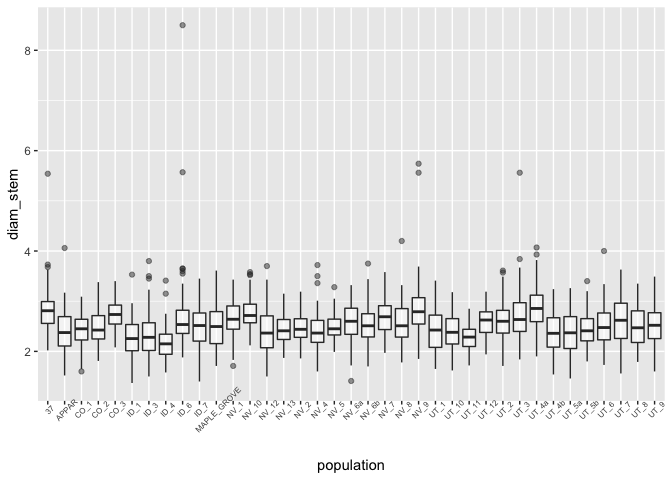<!-- -->

``` r
# capsule diameter
ggplot(data=filter(stem_data, trt=="B"), aes(x=population, y=diam_caps)) +
  geom_boxplot(alpha=0.5) + 
  theme(axis.text.x = element_text(angle=45, size=6))
```

    ## Warning: Removed 2810 rows containing non-finite values (stat_boxplot).

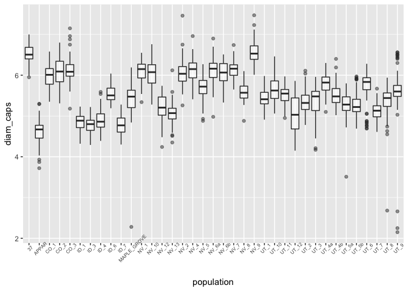<!-- -->
